= Streaming Data Processing

== Overview

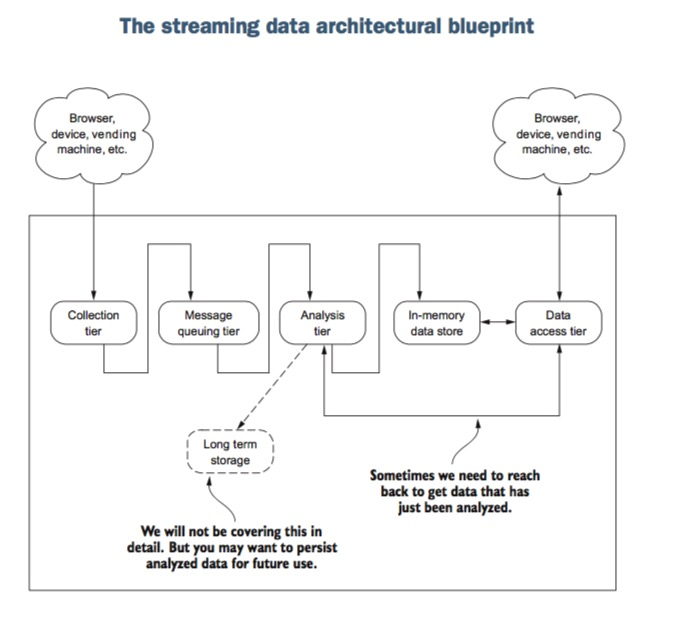

There are server common components in the streaming data processing system:

- collection tier
- message tier
- analysis tier
- long term storage
- in memory data store
- data access tier

=== Difference Between Real-Time and Streaming

- Classification Of Real-Time Systems

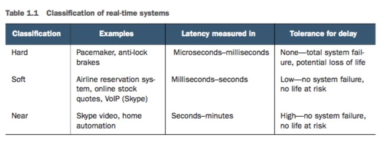

**soft/near based on perceived delay experienced by consumer**

- Generic Real-Time System

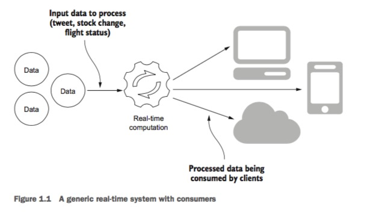

- Difference Between real-time and streaming system

Streaming data system:a non-hard real-time system that makes its data available at the moment a client application needs
it. It’s neither soft nor near real-time system

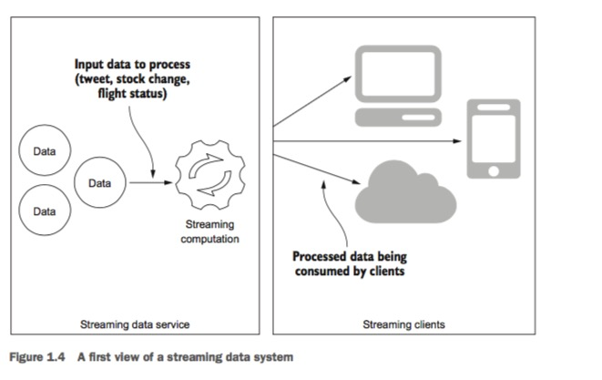

- Streaming Data System with Security

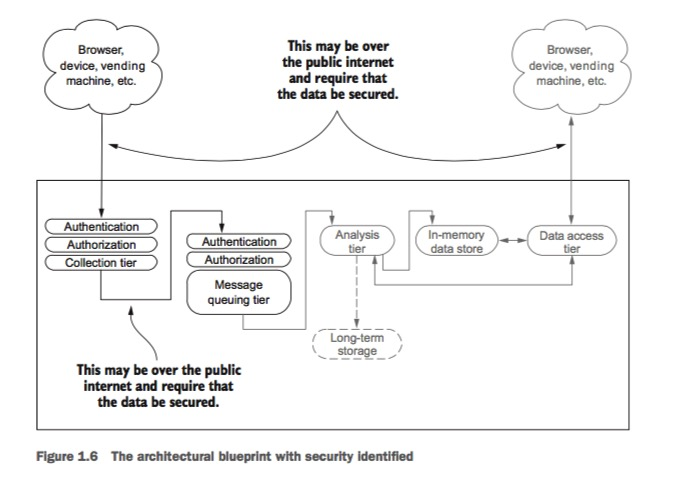

=== Scale

- vertical scaling: increase hardware or resource in one server
- horizontal scaling: adding more commodity servers

== 1. Collection Tier

Collection Tier is the first step of a streaming data system.It collects
the data from clients then pass these data into streaming data pipeline.
There are several common interaction patterns for collecting data:

- Request/response pattern
- Publish/subscribe pattern
- One-way pattern
- Request/acknowledge pattern
- Stream Pattern

=== 1.1 Collection Pattern- Request/Response

It is the simplest pattern. It is that client sends request and wait
for the server response. There are two different modes:

- sync mode:

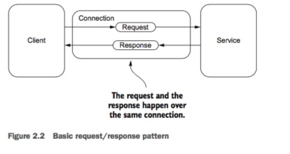

- async/half async mode:

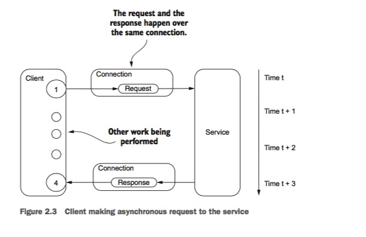

=== 1.2 Collection Pattern- Acknowledge Pattern

Like Request/Response Pattern, but this pattern return potential useful data for another requests.

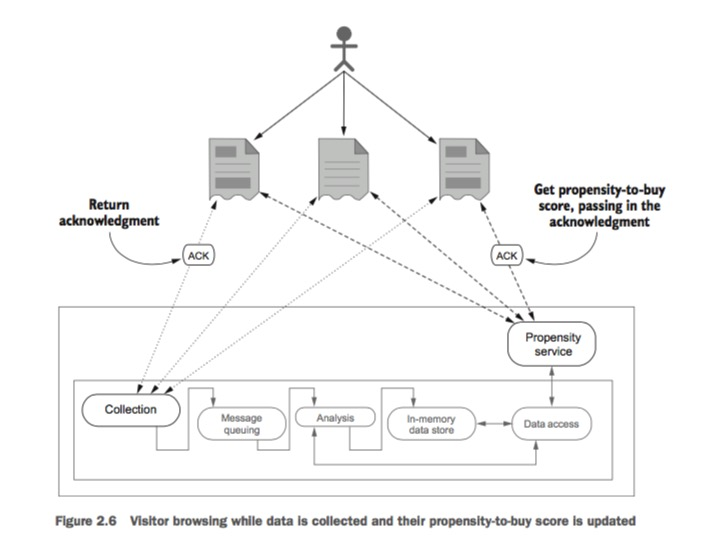

=== 1.3 Collection Pattern - Publish/subscribe pattern
This is common pattern with message-based data system.

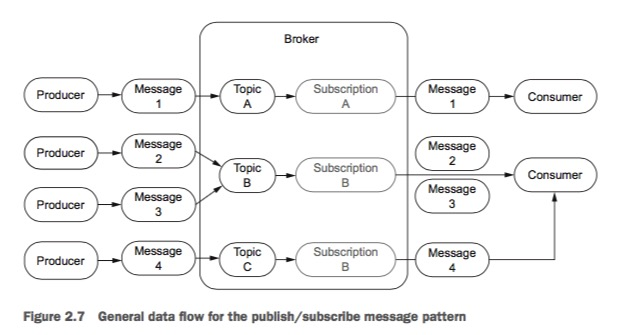

Here is a real example for car/traffic system.

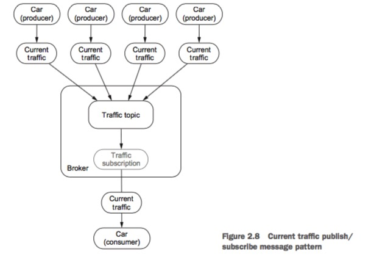

cars produces the traffic information and send it to traffic topic,
at the same times, cars also get the traffic topic information.The Message
system is in the center to combine all traffic information.

=== 1.4 One-way pattern

It is also a simple pattern, clients just send request but don't need
a response. For example,if we want to monitor the servers, the serve sends the machine metrics to monitor server
but don't need to get any response or take any action. Any action to be taken depends on the monitor server and the
alert system. Another example is like football player take with RFID sensor to play game,
the sensor sends all the data like movement,distance and speed to server but no need any response at all.

=== 1.5 Stream Pattern

It is quite different with all the patterns above.

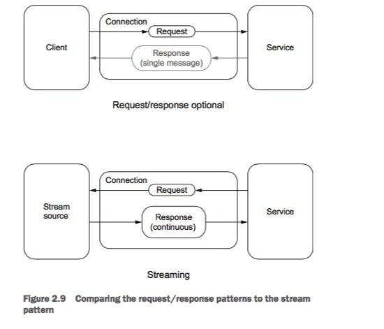

Continuous,that's the key difference! But what is the exactly meaning of continuous?

