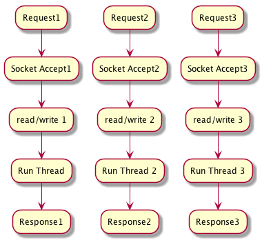

# Netty

## Blocking IO

One Request one Thread, context-switch is big

## None-Blocking IO

- reduce context-switch 
- reduce threads
- event-processing

who used netty:

- Infinispan
- HornetQ
- Vert.x
- Apache Cassandra
- Elasticsearch
- Finagle
- Nifty/Thrift

## Netty Components

- Channels
    * FileChannel
    * DatagramChannel
    * SocketChannel
    * ServerSocketChannel
    * Channel to ChannelTransfer
- Buffers
    * ByteBuffer
    * CharBuffer
    * DoubleBuffer
    * FloatBuffer
    * IntBuffer
    * LongBuffer
    * ShortBuffer
    * MappedByteBuffer
    * NIOBuffer
    * NIO Scatter/Gather
- Callback
- Future
- Event
- Handler
  * log
  * data converter 
  * control flow
  * logic
- Future/Callback/HANDLER
- SELECTOR/EVENT/EVENT LOOP
  * Register Event
  * Invoke ChannelHandler
  * EventFlow
- EventLoop
  * Distribute Events
  * Handle IO event
  
## Event Flow

## Netty Echo Server

- Client
- Server

